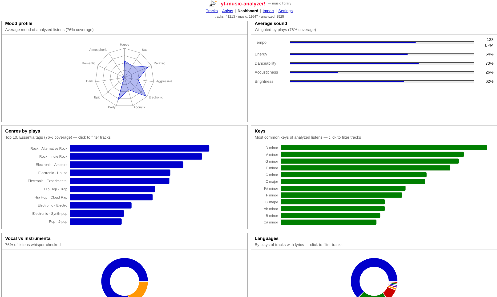
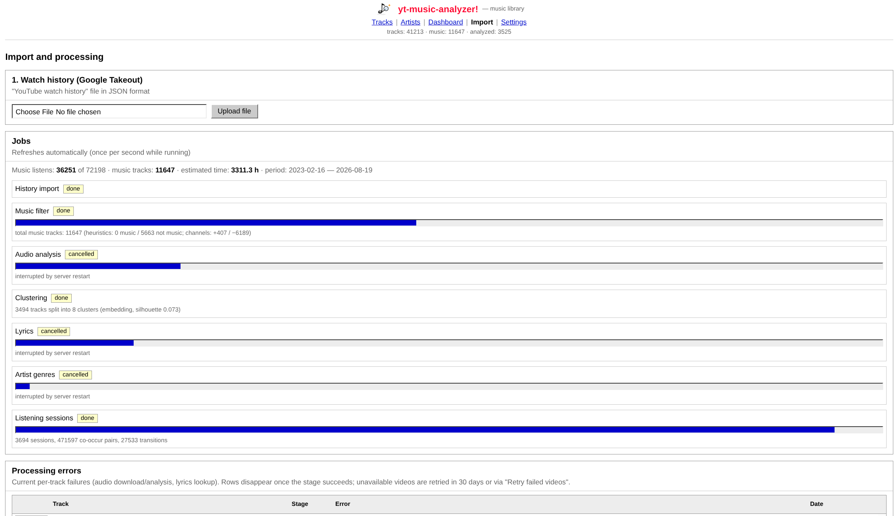
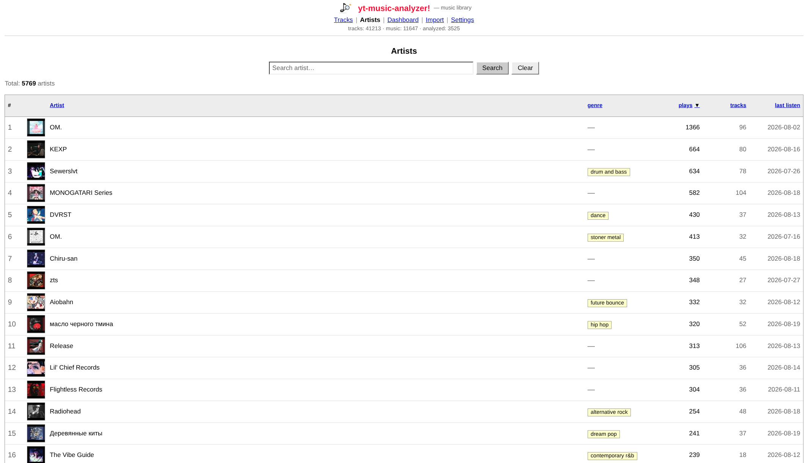
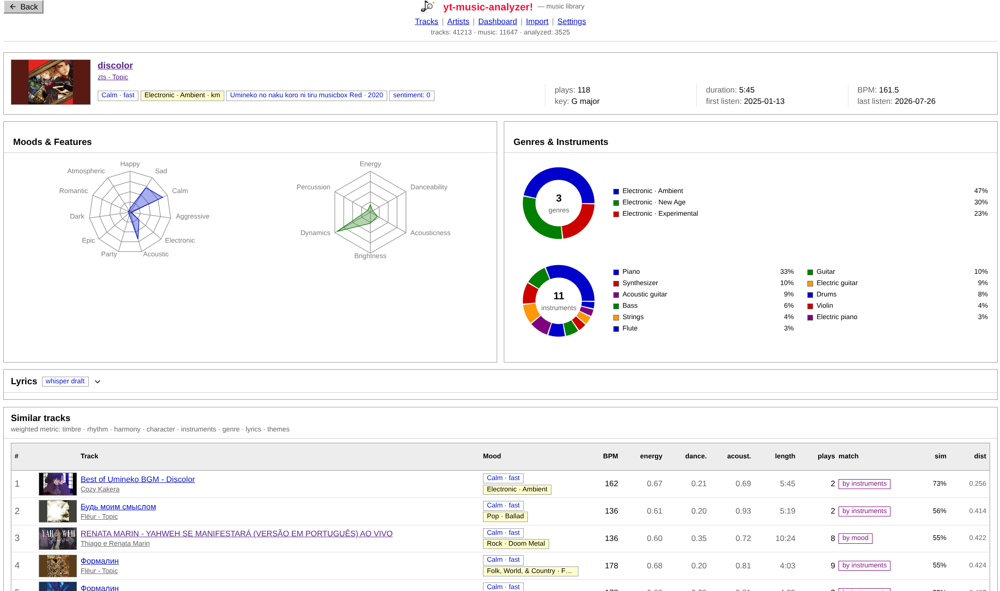
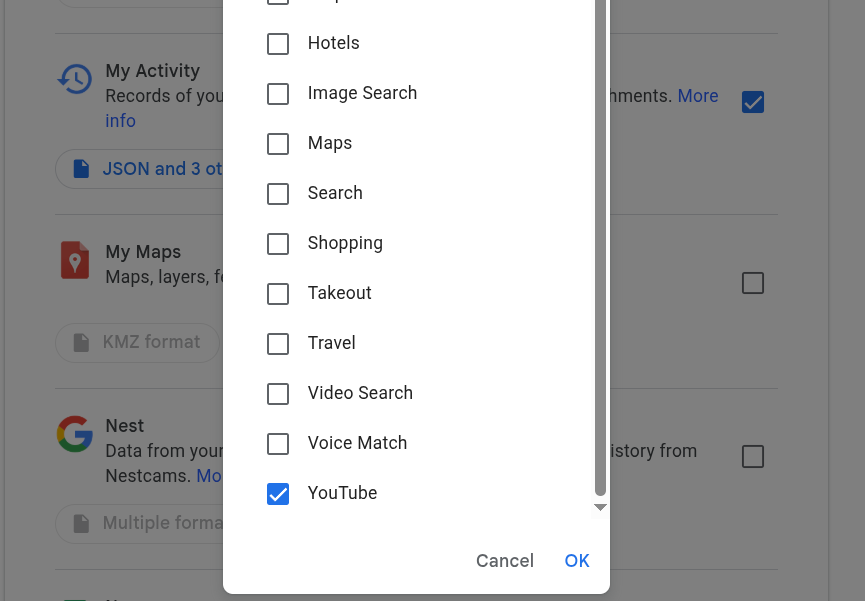
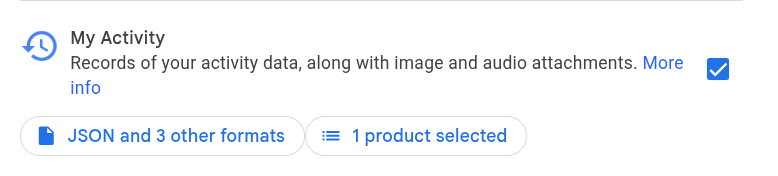

# yt-music-analyzer

A local, self-hosted analytics dashboard for your **YouTube watch history**.

The data source is not the YouTube API — it is your own **YouTube watch
history** exported via [Google Takeout](https://takeout.google.com)
(product **My Activity**, content **YouTube** — the full record of
everything you watched). You import it
once, the app filters out music, and then YouTube (plus a few open
services) is used only to _enrich_ those tracks: download audio for
analysis, fetch metadata and "similar" tracks, look up lyrics and genres.

What you get:

- **Listening stats** — top tracks/artists, hours, day-of-week patterns,
  discoveries (artists you heard for the first time)
- **Audio analysis** — mood, BPM, energy, danceability, acoustic-ness,
  key (Essentia models, computed locally from the audio)
- **Behavior-based recommendations** — "what to play right now" from your
  own habits: co-occurrence, Markov chains, embeddings and YT Music
  "similar" tracks, with a reason shown for every suggestion
- **Vocal/instrumental detection and lyrics** (LRCLIB + Whisper spot-checks)
- **Artist pages, listening sessions, harmonic-mixing compatibility**

Everything runs locally: SQLite storage, FastAPI backend, React frontend.
No accounts, no telemetry. External services are used anonymously and
require no API keys.

## Screenshots

| Dashboard                                    | Import pipeline                        |
| -------------------------------------------- | -------------------------------------- |
|  |  |

| Artists                                  | Track page                           |
| ---------------------------------------- | ------------------------------------ |
|  |  |

## Requirements

- **Linux** or **macOS** (on Windows: use **WSL2** with Ubuntu — full
  functionality, see below)
- internet access (downloads: Python/Node packages, Essentia/Whisper
  models, YouTube audio)
- a browser logged into YouTube (Chrome by default — used for cookies,
  see below)

Everything else (`uv`, Node.js >= 20, ffmpeg, the POT token server) is
installed by the setup script.

## Quick start

```bash
git clone <this-repo>
cd yt-music-analyzer
./setup.sh     # one-time: installs deps, builds the frontend, fetches POT server
./start.sh     # serves the app on http://127.0.0.1:8000
```

Then open **http://127.0.0.1:8000**.

`setup.sh` is idempotent — re-run it any time (e.g. after pulling updates).

### Windows: run in WSL2

On Windows the app runs inside
[WSL2](https://learn.microsoft.com/en-us/windows/wsl/install) (Ubuntu
recommended) and has **full functionality**, including audio analysis.
There is no native Windows mode.

```powershell
wsl --install -d Ubuntu     # in PowerShell, then reboot and create a user
```

Inside the WSL terminal — the usual Linux quick start:

```bash
sudo apt update && sudo apt install -y git curl
git clone <this-repo>
cd yt-music-analyzer
./setup.sh
./start.sh
```

Open **http://127.0.0.1:8000** on Windows (WSL2 forwards localhost
automatically).

**WSL cookies note:** the browser with YouTube login lives on Windows, so
cookie extraction from a browser is not available. Export cookies manually:

1. In Chrome on Windows, install an extension like
   _Get cookies.txt LOCALLY_ and export cookies for `youtube.com`
   (Netscape format).
2. Save the file as `backend/data/cookies.txt` (from WSL it is reachable
   under `/mnt/c/...`).
3. In the app **Settings**, clear **Browser for cookies** — the app will
   then use your manual `cookies.txt`.

## First run: importing your history

The app starts with an empty database. Your data source is your
**YouTube watch history** exported via Google Takeout — not the YouTube
API:

1. Go to [takeout.google.com](https://takeout.google.com) → deselect all →
   select the **My Activity** product → open its content options
   ("1 product selected") → check only **YouTube** → OK → set the export
   format to **JSON** → create and download the export. You need the
   watch history JSON file from the archive (`MyActivity.json` /
   `watch-history.json` — both work).
   
   
2. Start the app and open the **Import** page.
3. Upload that JSON file — this fills the
   database with everything you ever watched.
4. Run the pipeline steps **in order** (buttons on the Import page):
   1. **Music filter** — keeps only music tracks (heuristic, or exact
      with a `YOUTUBE_API_KEY`)
   2. **Audio analysis** — downloads audio from YouTube and extracts
      mood/tempo/key features (top tracks first; models are downloaded
      once into `data/models/`)
   3. **Clustering** — groups similar tracks
   4. **Lyrics** — fetches lyrics and detects vocals
   5. **MusicBrainz genres** — artist genres/info
   6. **Sessions** — reconstructs listening sessions

5. When the pipeline is done, explore the **Dashboard** — stats, moods,
   recommendations with reasons, discoveries.

Analysis skips tracks with fewer than `MIN_PLAY_COUNT` (default 2) plays.
Subsequent runs are incremental: cached audio and previously processed
tracks are not redone. YouTube itself is only contacted during enrichment
steps (audio downloads, metadata) — your listening history stays local.

## Configuration

Defaults work out of the box. Optional tuning via `backend/.env`
(copy `backend/.env.example`) or the **Settings** page in the UI:

| Setting                      | Default     | Purpose                                                                                                                                                |
| ---------------------------- | ----------- | ------------------------------------------------------------------------------------------------------------------------------------------------------ |
| `AUDIO_COOKIES_FROM_BROWSER` | `chrome`    | browser yt-dlp takes YouTube cookies from (`chrome`, `brave`, `firefox`, `edge`, or empty for none; empty enables a manual `backend/data/cookies.txt`) |
| `AUDIO_COOKIES_KEYRING`      | `basictext` | cookie decryption keyring — **Linux only**; ignored on macOS/Windows                                                                                   |
| `YOUTUBE_API_KEY`            | empty       | exact music filtering instead of heuristics                                                                                                            |
| `AUDIO_WORKERS`              | `2`         | parallel downloads (higher = more bot-detect risk)                                                                                                     |
| `MIN_PLAY_COUNT`             | `2`         | listen threshold for audio analysis / lyrics                                                                                                           |

Runtime data lives in `backend/data/`: SQLite DB, audio cache, downloaded
models, cookies. Delete it to start over.

## Development

```bash
./dev.sh      # backend with --reload + Vite dev server with HMR
```

- Backend: FastAPI + SQLModel, `backend/app/` — DB schema is created and
  migrated automatically on startup.
- Frontend: React 19 + Vite + Tailwind 4, `frontend/src/`.
- Tests/lint: none configured; frontend build (`tsc`) is the type gate.

## Troubleshooting

**Downloads fail with "Sign in to confirm you're not a bot" / 403 / 429**
YouTube throttles datacenter/flagged IPs. The app mitigates this with the
bgutil POT token server (installed by setup into `backend/data/tools/`,
auto-started on demand, needs Node.js) and your browser cookies. Make sure
you are logged into YouTube in Chrome (or set `AUDIO_COOKIES_FROM_BROWSER`).
If it still fails, wait and retry — the job backs off automatically.

**"ffmpeg not found" in server log** — audio analysis needs ffmpeg on PATH.
Install via your package manager (`apt install ffmpeg`, `brew install ffmpeg`).

**First audio analysis is slow** — Essentia and Whisper models (~hundreds of
MB) download once into `backend/data/models/`. Progress is shown on the job.

**Cookie extraction errors** — Chrome must be installed and logged into
YouTube; close Chrome while cookies are being read if your OS locks the
cookie store. Use a different browser via `AUDIO_COOKIES_FROM_BROWSER`
if needed. On WSL, browser cookies are not reachable at all — use a manual
`backend/data/cookies.txt` instead (see the WSL section above).

**Port 8000 busy** — stop the other process or run uvicorn with another
`--port` (frontend proxy in dev assumes 8000).

## Acknowledgments

- [Essentia](https://essentia.upf.edu/) (UPF) — audio feature models
- [faster-whisper](https://github.com/SYSTRAN/faster-whisper) — vocal spot-checks
- [bgutil-ytdlp-pot-provider](https://github.com/Brainicism/bgutil-ytdlp-pot-provider) — YouTube PO tokens (GPL-3.0, fetched at setup)
- [yt-dlp](https://github.com/yt-dlp/yt-dlp), [ytmusicapi](https://github.com/sigma67/ytmusicapi),
  [MusicBrainz](https://musicbrainz.org/), [LRCLIB](https://lrclib.net/),
  [ListenBrainz Labs](https://labs.api.listenbrainz.org/)
